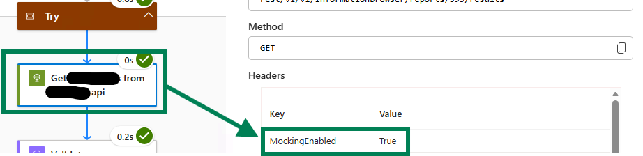
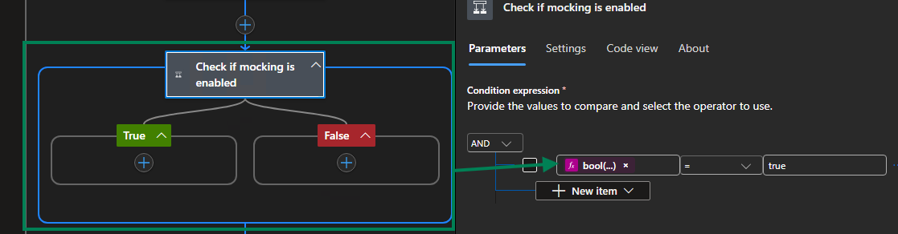
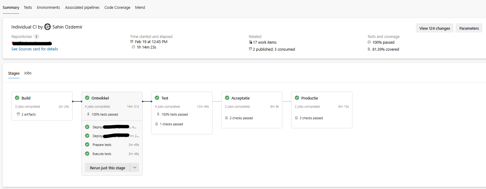
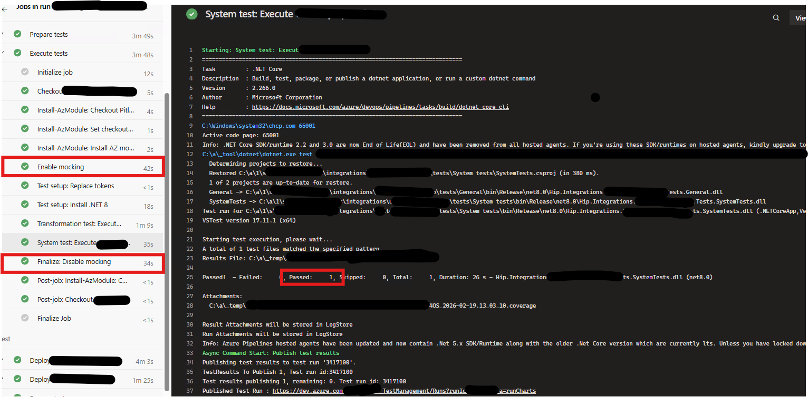
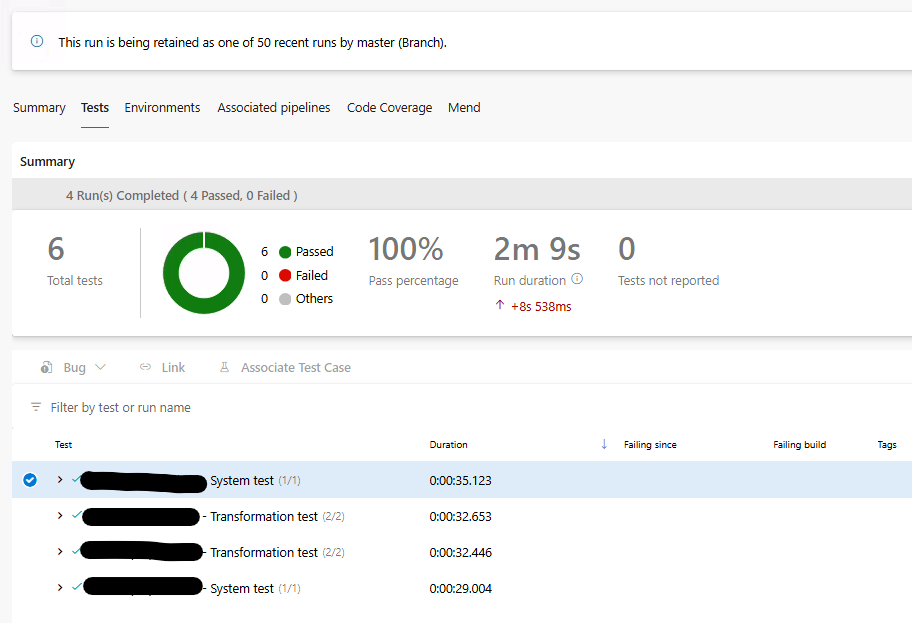

# Logic Apps Standard  -  Integration Testing Framework

A .NET testing framework for **Azure Logic Apps Standard** that provides an object-oriented C# API for interacting with Logic Apps at runtime and a Gherkin-based acceptance testing layer built on top of [Reqnroll](https://reqnroll.net/). It is designed to run as part of your DevOps deployment pipeline  -  after a deployment to a Development or Test environment  -  to perform full end-to-end integration testing directly against Azure.

---

## Table of Contents

1. [What This Framework Does](#what-this-framework-does)
2. [How It Compares to Microsoft's Built-In Testing Options](#how-it-compares-to-microsofts-built-in-testing-options)
3. [Installing the Packages](#installing-the-packages)
4. [Prerequisites and Configuration](#prerequisites-and-configuration)
5. [IsMockEnabled  -  Putting an Environment Under Test](#ismockenabled--putting-an-environment-under-test)
6. [Using the Management Framework Directly in .NET](#using-the-management-framework-directly-in-net)
7. [Sending Messages to Azure Service Bus](#sending-messages-to-azure-service-bus)
8. [Uploading Blobs to Azure Storage Account](#uploading-blobs-to-azure-storage-account)
9. [Writing Tests in Gherkin](#writing-tests-in-gherkin)
10. [Sample Workflow Definitions](#sample-workflow-definitions)
11. [Unit Test Coverage](#unit-test-coverage)

---

## What This Framework Does

### The Problem

Azure Logic Apps Standard provides no first-class .NET API for interacting with workflow runs at runtime. When you want to test your integration logic after deployment, you are left writing raw HTTP calls to the Azure Management REST API, manually deserialising complex JSON, and building your own polling and retry logic. Testing nested structures  -  actions inside scopes, conditions, loops, switch cases  -  requires understanding deeply nested raw JSON responses. There is no object model, no abstraction, and no way to write readable, maintainable acceptance tests.

### The Solution

This framework delivers two things:

---

### 1. The Management Library  -  Object-Oriented Access to Logic Apps Standard

The `LogicApps.Management` library is a full object-oriented .NET model of Azure Logic Apps Standard. It wraps the Azure Management REST API and exposes everything you would want to interact with as strongly typed C# objects. The entire library is fully asynchronous.

**What you can do with it:**

- Retrieve a `LogicApp` instance representing your deployed Logic Apps Standard resource
- List all `Workflow` objects within the app, retrieve their definitions, and invoke their triggers
- Fetch `WorkflowRun` instances filtered by time range, correlation ID, or status
- Navigate the complete action tree of any run  -  top-level actions, actions inside **Scope** containers (Try/Catch/Finally), branches of **Condition** actions (true and false), cases of **Switch** actions, and individual iterations of **ForEach** and **Until** loops  -  all through a clean object model
- Find any action by name anywhere in the tree using a depth-first search, regardless of how deeply nested it is
- Read action inputs, outputs, status, error information, and tracked properties

Each action type is modelled with its own class: `ScopeAction`, `ConditionAction`, `SwitchAction`, `ForEachAction`, `UntilAction`, and the base `Action` for standard connectors. Repetitions within loops are themselves modelled as typed objects (`ForEachActionRepetition`, `UntilActionRepetition`), each capable of loading their own child actions on demand.

This means that from C#, reading a run's data looks like navigating an object graph  -  not parsing raw JSON.

---

### 2. The Specifications Layer  -  Gherkin-Based Acceptance Testing

The `LogicApps.TestFramework.Specifications` library wraps the Management library in a full set of Reqnroll step definitions, enabling business-readable Gherkin scenarios that test complete workflow chains end-to-end.

**What this enables:**

- **Trigger workflows** from test scenarios  -  by invoking the HTTP trigger directly, by uploading a payload to Azure Blob Storage and sending a claim-check message to Azure Service Bus, or by file-based input
- **Wait for completion**  -  the framework polls automatically and caches the run once it completes, minimising API calls
- **Assert on workflow execution** at any level of the action tree  -  top-level actions, deeply nested actions inside scopes and conditions, specific loop iterations, all iterations of a loop, switch case branches, and nested loops
- **Validate data transformations** (XSLT, Liquid) by reading the action output and deserialising it into a strongly typed C# model for field-level assertions
- **Validate correlated multi-workflow chains**  -  trigger a receive workflow and then validate all correlated processor and sender instances using the same correlation identifier that was set during the receive run

The step definitions maintain an internal context (the current workflow and its run list) that is automatically set when a workflow is triggered or when a named workflow step executes. All subsequent assertion steps in the scenario reuse this cached context, resulting in minimal API calls and fast test execution.

For transformation testing specifically, the framework provides `BaseTransformationStepDefinition<TSource, TDestination>`  -  a generic base class that handles all the infrastructure (storage upload, service bus claim-check, run polling, output deserialisation) and requires the concrete test class only to implement a single method: how to deserialise the transformation output body into the destination type.

---

## How It Compares to Microsoft's Built-In Testing Options

Microsoft provides several tools for testing Logic Apps Standard. This framework takes a fundamentally different approach and addresses gaps that none of the Microsoft tools cover.

| Microsoft Offering | Scope | Limitation |
|---|---|---|
| **Built-in Automated Test Framework** | Visual Studio Code extension | Requires manual test case creation in VS Code, no programmatic API, no CI/CD integration without custom scripting, limited assertion capability |
| **Automated Test SDK** | .NET SDK for unit-style tests | Runs workflows locally in isolation, not against a live deployed environment, no real connector execution |
| **Unit Test Generation (VS Code)** | Code generation tool | Generates unit tests for local execution only, still requires manual assertion authoring, no integration-level testing |
| **Mocking / Static Results Testing** | Local mock execution | Replaces connector calls with static values locally, not a substitute for real deployed integration testing |
| **Data Mapper Test Executor** | XSLT/map validation | Validates data mapping logic in isolation only, no workflow context |
| **Local Debugging + Test Execution (VS Code)** | Developer-time tooling | Manual, interactive, not automatable in a pipeline |

**Where this framework is different:**

1. **It runs against the real deployed environment.** Not local emulation, not mocked connectors. The workflow runs in Azure, against the real infrastructure  -  Service Bus, Storage Account, API Management, and downstream systems. You are testing what is actually deployed.

2. **It is designed for your DevOps pipeline.** Every scenario is a NUnit test that produces a standard pass/fail result. Drop the test project into your Azure DevOps or GitHub Actions pipeline after the deployment step. If the tests pass, the deployment is verified. If they fail, the pipeline stops.

3. **It provides a proper object model.** The Microsoft SDK does not give you a navigable object graph of a live workflow run. This framework does. Finding an action at any nesting depth, reading its output, checking its status  -  these are single method calls on strongly typed objects.

4. **It supports real end-to-end chain validation.** Testing a receive-process-send chain across three workflows, where the processor has five correlated instances each with nested loops and condition branches, is expressed in a single readable Gherkin scenario. No Microsoft tool handles this.

5. **It enables transformation testing against live data.** You can trigger a real transformation workflow with a real message, wait for it to complete, deserialise the XSLT or Liquid output into a typed C# model, and assert on individual fields  -  in a single test scenario. This is not possible with any Microsoft-provided tool.

6. **It supports mocking for isolated integration testing.** By leveraging the `IsMockEnabled` feature described below, you can put source and target systems into a mocked state during test runs. This means you can test the full workflow behaviour  -  including send actions to SFTP servers, calls to APIs through API Management  -  without polluting production or staging systems. The Microsoft tooling does not provide a mechanism for this in a deployed environment.

**Bottom line:** Microsoft's tools are useful during development, locally, in VS Code. This framework is what you use after deployment, in your pipeline, to verify that the integration works end to end in a real environment.

---

## Installing the Packages

The framework is distributed as four NuGet packages. In most cases you only need to reference one of them — NuGet resolves the others automatically as transitive dependencies.

| Package | Install when you want to... |
|---|---|
| `LogicApps.TestFramework.Specifications` | Write Gherkin-based integration tests (the most common case) |
| `LogicApps.Management` | Write custom C# integration tests without the Gherkin layer |
| `LogicApps.Management.Repository` | Use only the Service Bus or Blob Storage helpers in isolation |
| `LogicApps.Management.Models` | Use only the data model classes — pulled in automatically, rarely installed directly |

---

### Install from NuGet.org

Packages are published to [nuget.org](https://www.nuget.org/profiles/sahinozd) and can be installed with no additional configuration.

**.NET CLI**

```bash
# Full Gherkin test framework
dotnet add package LogicApps.TestFramework.Specifications

# Management API only (no Gherkin)
dotnet add package LogicApps.Management
```

**Package Manager Console (Visual Studio)**

```powershell
Install-Package LogicApps.TestFramework.Specifications
```

**PackageReference in `.csproj`**

```xml
<PackageReference Include="LogicApps.TestFramework.Specifications" Version="1.1.0" />
```

Replace `1.1.0` with the version you want. See the [releases page](https://github.com/sahinozd/LogicAppsStandard.Testing/releases) for the latest version number.

---

### Install from GitHub Packages

Packages are also published to [GitHub Packages](https://github.com/sahinozd/LogicAppsStandard.Testing/packages). GitHub Packages requires authentication even for public packages, so two extra steps are needed.

#### Step 1 — Create a GitHub Personal Access Token (PAT)

1. Go to [github.com](https://github.com) → click your profile picture → **Settings**
2. In the left sidebar click **Developer settings** → **Personal access tokens** → **Tokens (classic)**
3. Click **Generate new token (classic)**
4. Give it a name (e.g. `NuGet read`) and tick the **`read:packages`** scope
5. Click **Generate token** and copy the value — you will not be able to see it again

#### Step 2 — Add the GitHub Packages source

Create or update a `nuget.config` file in the root of your solution (next to your `.sln` or `.slnx` file):

```xml
<?xml version="1.0" encoding="utf-8"?>
<configuration>
  <packageSources>
    <add key="nuget.org" value="https://api.nuget.org/v3/index.json" />
    <add key="github" value="https://nuget.pkg.github.com/sahinozd/index.json" />
  </packageSources>
  <packageSourceCredentials>
    <github>
      <add key="Username" value="YOUR_GITHUB_USERNAME" />
      <add key="ClearTextPassword" value="YOUR_PAT" />
    </github>
  </packageSourceCredentials>
</configuration>
```

Replace `YOUR_GITHUB_USERNAME` with your GitHub username and `YOUR_PAT` with the token you created in Step 1.

> **Important:** Do not commit `nuget.config` with a real PAT to source control. Either add it to `.gitignore`, use environment variable substitution, or store the credentials in your user-level NuGet config (`%appdata%\NuGet\NuGet.Config` on Windows) instead.

#### Step 3 — Install as normal

Once the source is registered, install the package using any of the standard methods:

```bash
dotnet add package LogicApps.TestFramework.Specifications
```

```xml
<PackageReference Include="LogicApps.TestFramework.Specifications" Version="1.1.0" />
```

---

### Storing credentials safely in a CI/CD pipeline

If you are consuming these packages in your own pipeline, add the GitHub Packages source using environment variables rather than committing credentials.

**GitHub Actions**

```yaml
- name: Add GitHub Packages source
  run: |
    dotnet nuget add source \
      --username "${{ github.actor }}" \
      --password "${{ secrets.GITHUB_TOKEN }}" \
      --store-password-in-clear-text \
      --name github \
      "https://nuget.pkg.github.com/sahinozd/index.json"
```

The built-in `GITHUB_TOKEN` secret has `read:packages` permission automatically — no PAT is needed in GitHub Actions.

**Azure DevOps**

Add the GitHub Packages feed as an external NuGet service connection in your Azure DevOps project, then reference it in your pipeline:

```yaml
- task: NuGetAuthenticate@1

- task: DotNetCoreCLI@2
  inputs:
    command: restore
    feedsToUse: config
    nugetConfigPath: nuget.config
```

---

## Prerequisites and Configuration

### Azure Infrastructure

The following Azure resources are required:

- **Azure Logic Apps Standard** instance containing the workflows under test
- **Azure Service Bus** namespace, used to trigger workflows via the claim-check pattern and to validate send-side behaviour. This is complementary if your workflows are e.g. decoupled by Service Bus (or triggered by it)
- **Azure Storage Account**, used to store message payloads as part of the claim-check pattern. Also complementary, in the examples provided, decoupling happens through Service Bus, via the [claim-check pattern](https://learn.microsoft.com/en-us/azure/architecture/patterns/claim-check)

### Entra ID App Registration

Create an App Registration in Microsoft Entra ID with the following:

- A **client secret** (used for authentication)
- The application permission **`access_as_application`** (Application ID: `25c1e7fc-03c5-4fdd-b076-716ebcb74a84`) enabled

Assign the following **RBAC roles** to the App Registration on the respective resources:

| Resource | Role |
|---|---|
| Logic Apps Standard | **Website Contributor** |
| Storage Account | **Storage Blob Data Contributor** and **Storage Blob Data Reader** |
| Service Bus Namespace | **Azure Service Bus Data Sender** and **Azure Service Bus Data Receiver** |

### appsettings.json

The integration test project reads configuration from an `appsettings.json` file. The values shown use the Azure DevOps token replacement syntax (`#{...}#`) so that the file can be committed safely and filled in at pipeline execution time.

```json
{
  "ClientId": "#{testFramework_client_id}#",
  "ClientSecret": "#{testFramework_client_secret}#",
  "TenantId": "#{testFramework_tenant_id}#",
  "SubscriptionId": "#{testFramework_subscription_id}#",
  "ResourceGroup": "#{testFramework_resource_group_name}#",
  "LogicAppName": "#{testFramework_la_name}#",
  "LogicAppApiVersion": "#{testFramework_la_api_version}#",
  "ServiceBusNamespace": "#{testFramework_sb_namespace}#",
  "StorageAccount": "#{testFramework_sa_name}#",
  "CorrelationIdActionName": "#{testFramework_correlation_id_action_name}",
  "VariableActionName": "Initialize_variables",
  "CorrelationIdVariableName": "correlationId"
}
```

| Key | Purpose |
|---|---|
| `ClientId` | The Application (client) ID of the Entra ID App Registration. Used to authenticate against the Azure Management API, Service Bus, and Storage Account. |
| `ClientSecret` | The client secret of the App Registration. Used together with `ClientId` and `TenantId` to obtain an access token from Entra ID. |
| `TenantId` | The Entra ID tenant (directory) ID. Identifies which directory to authenticate against. |
| `SubscriptionId` | The Azure subscription ID. Used to construct the Azure Management API resource path for the Logic Apps instance. |
| `ResourceGroup` | The name of the Azure Resource Group containing the Logic Apps Standard instance. |
| `LogicAppName` | The name of the Logic Apps Standard resource. Used to scope all workflow queries and trigger calls to the correct app. |
| `LogicAppApiVersion` | The Azure Management REST API version to use for Logic Apps calls (e.g. `2024-04-01`). |
| `ServiceBusNamespace` | The Service Bus namespace hostname prefix (e.g. `my-servicebus`). The framework builds the full hostname as `{namespace}.servicebus.windows.net`. |
| `StorageAccount` | The Storage Account name (e.g. `mystorageaccount`). The framework builds the full endpoint as `{name}.blob.core.windows.net`. |
| `CorrelationIdActionName` | The name of the Logic Apps action that sets the correlation ID variable in the receive workflow. Used by the framework to capture the correlation ID from the run for use in correlated multi-workflow assertions. |
| `VariableActionName` | The name of the action that initialises variables (default: `Initialize_variables`). Used to locate the correlation ID variable within the run. |
| `CorrelationIdVariableName` | The name of the variable within the initialise-variables action that holds the correlation ID (default: `correlationId`). |

---

## IsMockEnabled  -  Putting an Environment Under Test

When running integration tests against a deployed Development or Test environment, you often do not want your workflows to call real downstream systems. Sending messages to an SFTP server, calling a production CRM API, or writing to a live database pollutes target systems with test data and creates unwanted side effects.

The `IsMockEnabled` flag is an application setting pattern that allows you to put the entire environment into a **test mode** without modifying any workflow definitions.

### How It Works

A Logic Apps Standard workflow parameter `IsMockEnabled` (boolean) is read at runtime and used as a routing decision inside the workflow. Examples of how this is used in practice:

- **API Management**: the `IsMockEnabled` value is passed as a request header. An API Management policy reads this header and returns a mocked response when it is `true`, bypassing the real backend entirely.
- **Send workflows**: a condition on `IsMockEnabled` skips the actual SFTP write, HTTP call, or queue send and instead routes to a no-op branch.
- **Receive workflows**: a mocked trigger payload can be substituted when the flag is set.

This means your integration tests can exercise the full workflow logic  -  transformation, routing, error handling, tracked properties  -  without any data reaching source or target systems. The test environment is fully isolated from an external perspective, but the workflow runs exactly as it would in production from an internal perspective.

### Configuration

The steps below describe a complete end-to-end setup. The pipeline fragments shown are for **Azure DevOps YAML pipelines** and are illustrative  -  the exact implementation will vary depending on your project structure, service connection names, and parameter conventions.

---

#### Step 1  -  Provision the app setting in your infrastructure

Add `isMockEnabled` to the Logic Apps Standard app settings in your Bicep infrastructure code. Set the default value to `'False'` so mocking is always off in production.

```bicep
resource logicAppsStandardConfig 'Microsoft.Web/sites/config@2025-03-01' = {
  name: 'web'
  parent: logicAppsStandard
  properties: {
    ftpsState: 'Disabled'
    netFrameworkVersion: 'v8.0'
    use32BitWorkerProcess: false
    alwaysOn: true
    functionsRuntimeScaleMonitoringEnabled: true
    vnetPrivatePortsCount: 2
    functionAppScaleLimit: int(Configuration.integration.workload.maxScaleInstances!)
    healthCheckPath: '/api/chk-health/triggers/Request/invoke?api-version=2022-05-01'
    minimumElasticInstanceCount: int(Configuration.integration.workload.maxScaleInstances!)
    appSettings: allEnvironmentVariables  // merged with the entry below
    connectionStrings: []
    cors: {
      allowedOrigins: [
        environment().portal
      ]
      supportCredentials: false
    }
  }
}
```

In `allEnvironmentVariables`, include:

```bicep
{
  name: 'isMockEnabled'
  value: 'False'
}
```

---

#### Step 2  -  Reference the app setting in the Logic Apps parameters

In the Logic Apps Standard `parameters.json`, add an `IsMockEnabled` entry that reads its value from the app setting at runtime:

```json
"IsMockEnabled": {
  "type": "String",
  "value": "@appsetting('isMockEnabled')"
}
```

This makes `IsMockEnabled` available as a workflow parameter throughout all workflows in the Logic App, without hardcoding the value in the workflow definition.

---

#### Step 3  -  Implement IsMockEnabled in your workflows

There are two patterns depending on how the downstream system is called.

**Pattern A  -  API Management (pass the flag as a request header)**

When calling a backend through Azure API Management, pass `IsMockEnabled` as a custom request header. The API Management policy inspects the header and returns a mocked response when it is `True`, bypassing the real backend call entirely.



The corresponding API Management inbound policy:

```xml
<choose>
  <when condition="@(context.Request.Headers.GetValueOrDefault(&quot;MockingEnabled&quot;, &quot;False&quot;)
                    .Equals(&quot;True&quot;, StringComparison.OrdinalIgnoreCase))">
    <return-response>
      <set-status code="200" reason="OK" />
      <set-header name="Content-Type" exists-action="override">
        <value>application/json</value>
      </set-header>
      <set-body>{"successful": true}</set-body>
    </return-response>
  </when>
  <when condition="@(context.Request.Headers.GetValueOrDefault(&quot;MockingEnabled&quot;, &quot;False&quot;)
                    .Equals(&quot;False&quot;, StringComparison.OrdinalIgnoreCase))">
    <!-- Acquire token and call the real backend -->
    <send-request ignore-error="true" timeout="20"
                  response-variable-name="bearerToken" mode="new">
      <set-url>#{backend_url}#</set-url>
      <set-method>POST</set-method>
      <set-header name="Content-Type" exists-action="override">
        <value>application/x-www-form-urlencoded</value>
      </set-header>
      <set-body>#{token_request_body}#</set-body>
    </send-request>
    <!-- ... rest of real backend call ... -->
  </when>
</choose>
```

**Pattern B  -  Condition in the workflow (for protocols where a header cannot be passed)**

When calling a system that does not support passing a custom header  -  for example SFTP, FTP, or a direct database connector  -  use a **Condition** action in the workflow itself. The `True` branch skips the actual action; the `False` branch executes it normally.



The condition expression evaluates `bool(parameters('IsMockEnabled'))` against `true`. When mocking is enabled, the `True` branch contains a no-op action (or nothing at all). This ensures the real connector action is never executed during test runs, so no test data reaches the target system.

---

#### Step 4  -  Replace appsettings.json values during the pipeline

The integration test project reads its configuration from `appsettings.json` using the `#{...}#` token replacement syntax (see the [appsettings.json section](#appsettingsjson) for all keys). In your Azure DevOps pipeline, use a token replacement task in the deployment stage to fill in the correct values for the target environment before running the tests.

Ensure that at minimum the following values are set for the environment under test:

- `ClientId`, `ClientSecret`, `TenantId`  -  the Entra ID App Registration credentials
- `SubscriptionId`, `ResourceGroup`, `LogicAppName`  -  scopes the framework to the correct Logic App
- `ServiceBusNamespace`, `StorageAccount`  -  point to the Service Bus and Storage Account for the test environment

---

#### Step 5  -  Enable mocking before running the tests

Before executing the integration tests, set the `isMockEnabled` app setting to `True` using the Azure Management API. The `set.mocking.ps1` script at the root of this repository handles this.

Azure DevOps pipeline task:

```yaml
- task: AzurePowerShell@5
  displayName: 'Enable mocking'
  inputs:
    azureSubscription: '${{ parameters.AzureDevOpsServiceConnection }}'
    azurePowerShellVersion: 'LatestVersion'
    pwsh: true
    ScriptType: 'FilePath'
    ScriptPath: 'extras/set.mocking.ps1'
    ScriptArguments: >-
      -EnableMocking $True
      -LogicAppName "$(LogicAppName)"
      -ResourceGroupName "$(ResourceGroupName)"
      -SubscriptionId "$(SubscriptionId)"
```

The `set.mocking.ps1` script uses the Azure Management REST API to patch only the `isMockEnabled` app setting without overwriting any other settings:

```powershell
param (
    [Parameter()]
    [string]
    $AppSettingName = "isMockEnabled",

    [Parameter()]
    [Boolean]
    $EnableMocking = $true,

    [Parameter(Mandatory = $True)]
    [string]
    $LogicAppName,

    [Parameter(Mandatory = $True)]
    [string]
    $ResourceGroupName,

    [Parameter(Mandatory = $true)]
    [string]
    $SubscriptionId
)

$managementUri = "https://management.azure.com/subscriptions/$SubscriptionId/resourceGroups/$ResourceGroupName" +
                 "/providers/Microsoft.Web/sites/$LogicAppName/config/appsettings?api-version=2024-11-01"

$accessToken = (Get-AzAccessToken -ResourceUrl 'https://management.azure.com/' -AsSecureString).Token
$headers = @{
    'Authorization' = "Bearer $(ConvertFrom-SecureString $accessToken -AsPlainText)"
    'Content-Type'  = "application/json"
}

$appSettingsBody = @{
    properties = @{
        $AppSettingName = "$($EnableMocking)"
    }
}

$jsonBody = $appSettingsBody | ConvertTo-Json

Write-Output "Invoking management uri: $managementUri"

try {
    Invoke-RestMethod -Method PATCH -Uri $managementUri -Headers $headers -Body $jsonBody `
                      -ErrorAction Stop -ErrorVariable appSettingsError
}
catch {
    Write-Output "Failed to set app setting $AppSettingName for $LogicAppName."
    Write-Output $appSettingsError
}
```

The script is included in the repository as [extras/set.mocking.ps1](extras/set.mocking.ps1).

---

#### Step 6  -  Run the integration tests

Execute the integration test project. The framework connects to the deployed Logic App, sends messages, waits for workflow runs to complete, and asserts on the results.

```yaml
- task: DotNetCoreCLI@2
  condition: succeededOrFailed()
  displayName: 'Integration tests'
  inputs:
    command: 'test'
    projects: '$(Build.SourcesDirectory)/path/to/YourIntegrationTests.csproj'
    arguments: >-
      --configuration Release
      --collect "Code coverage"
    testRunTitle: 'Integration Tests - $(StageName)'
```

---

#### Step 7  -  Disable mocking after the tests

Always disable mocking after the test run, regardless of whether the tests passed or failed. This ensures the environment is not left in test mode.

```yaml
- task: AzurePowerShell@5
  displayName: 'Disable mocking'
  condition: always()    # run even if tests failed
  inputs:
    azureSubscription: '${{ parameters.AzureDevOpsServiceConnection }}'
    azurePowerShellVersion: 'LatestVersion'
    pwsh: true
    ScriptType: 'FilePath'
    ScriptPath: 'extras/set.mocking.ps1'
    ScriptArguments: >-
      -EnableMocking $False
      -LogicAppName "$(LogicAppName)"
      -ResourceGroupName "$(ResourceGroupName)"
      -SubscriptionId "$(SubscriptionId)"
```

> The `condition: always()` is important. Without it, a test failure would skip the disable step and leave the environment in mocked mode permanently.

---

#### Step 8  -  Typical pipeline structure

A complete Azure DevOps pipeline that incorporates deployment and integration testing typically looks like this, with a dedicated stage per environment:







The environment stages Development and Test follow the same sequence of jobs:

1. **Deploy**  -  deploy the Logic Apps Standard zip package and infrastructure
2. **Prepare tests**  -  replace `appsettings.json` tokens and enable mocking
3. **Execute tests**  -  run the integration test project
4. **Teardown**  -  disable mocking

This pattern ensures that every deployment to an environment is immediately verified by the full integration test suite before promotion to the next stage.

---

## Using the Management Framework Directly in .NET

The Management library can be used independently of the Gherkin layer, for example to write custom NUnit integration tests, diagnostic tools, or operational scripts.

### Setup

```csharp
using LogicApps.Management;
using LogicApps.Management.Factory;
using LogicApps.Management.Helper;
using LogicApps.Management.Repository;
using Microsoft.Extensions.DependencyInjection;

var configuration = AppSettings.Configuration;
var baseAddress = new Uri("https://management.azure.com");

var services = new ServiceCollection();
services.AddHttpClient("AzureManagementClient", client =>
{
    client.BaseAddress = baseAddress;
    client.DefaultRequestHeaders.Add("accept", "application/json");
    client.Timeout = TimeSpan.FromMinutes(5);
});
services.AddHttpClient("AzurePublicHttpClient", client =>
{
    client.Timeout = TimeSpan.FromMinutes(5);
});
services.AddHttpClient("EntraTokenClient");

var serviceProvider = services.BuildServiceProvider();
var httpClientFactory = serviceProvider.GetRequiredService<IHttpClientFactory>();

var tokenClient = new EntraTokenClient(httpClientFactory);
var azureHttpClient = new AzureHttpClient(
    httpClientFactory,
    tokenClient,
    baseAddress,
    configuration["TenantId"]!,
    configuration["ClientId"]!,
    configuration["ClientSecret"]!);

var repository = new AzureManagementRepository(azureHttpClient, baseAddress);
var actionHelper = new ActionHelper(repository);
var actionFactory = new ActionFactory(configuration, repository, actionHelper);

var logicApp = await LogicApp.CreateAsync(
    configuration,
    repository,
    actionFactory,
    actionHelper,
    loadRunsSince: DateTime.UtcNow.AddHours(-24));
```

### Retrieving Workflows and Runs

```csharp
// Get all workflows in the Logic App
var workflows = await logicApp.GetWorkflowsAsync();

// Find a specific workflow by name
var workflow = workflows.FirstOrDefault(w => w.Name == "prc");

// Get all runs for the workflow (cached after first call)
var runs = await workflow!.GetWorkflowRunsAsync();

// Filter to succeeded runs only
var succeededRuns = runs.Where(r => r.Status == "Succeeded").ToList();

// Get the most recent run
var latestRun = runs.MaxBy(r => r.StartTime);

// Get runs by correlation ID
var correlatedRun = runs.FirstOrDefault(r => r.CorrelationId == myCorrelationId);

// Clear the cache and reload from Azure
await workflow.ReloadAsync();
```

### Triggering a Workflow

```csharp
var trigger = await workflow!.GetTriggerAsync();

// Trigger without a body (e.g. recurrence workflows)
await trigger.Run(null);

// Trigger with a JSON body (e.g. HTTP-triggered workflows)
using var content = new StringContent("{\"key\":\"value\"}", new MediaTypeHeaderValue("application/json"));
await trigger.Run(content);

// Trigger with additional request headers
var headers = new Dictionary<string, string> { { "x-custom-header", "value" } };
await trigger.Run(content, headers);
```

### Navigating the Action Tree

Actions at every nesting depth are returned by `GetWorkflowRunActionsAsync` as typed objects. The returned list contains only top-level actions; nested actions are reachable through the properties of their parent.

```csharp
var run = runs.First();

// Get top-level actions for this run
var actions = await run.GetWorkflowRunActionsAsync();

foreach (var action in actions)
{
    Console.WriteLine($"{action.DesignerName}: {action.Status}");
    Console.WriteLine($"  Start: {action.StartTime}, End: {action.EndTime}");

    // Read the raw action output (JToken)
    if (action.Output != null)
        Console.WriteLine($"  Output: {action.Output}");

    // Read error information when the action failed
    if (action.Error != null)
        Console.WriteLine($"  Error: {action.Error.Code} - {action.Error.Message}");
}
```

### Finding an Action Anywhere in the Tree

`FindActionByNameAsync` performs a depth-first search across the entire action tree, including actions inside scopes, conditions, loop iterations, and switch cases.

```csharp
// Returns all actions matching the name, at any nesting depth
var matchingActions = await run.FindActionByNameAsync("Transform source data type to target data type");
var transformAction = matchingActions?.FirstOrDefault();

Console.WriteLine($"Status: {transformAction?.Status}");
Console.WriteLine($"Output: {transformAction?.Output}");
```

### Reading Actions Inside a Scope

A `ScopeAction` (Try, Catch, Finally, or any named scope) exposes its children through the `Actions` property, which is populated when the parent run's actions are loaded.

```csharp
var scopeAction = actions.OfType<ScopeAction>().FirstOrDefault(a => a.DesignerName == "Try");

foreach (var child in scopeAction!.Actions)
{
    Console.WriteLine($"  {child.DesignerName}: {child.Status}");
}
```

### Reading Condition Branches

A `ConditionAction` exposes its true branch via `DefaultActions` and its false branch via `ElseActions`.

```csharp
var conditionAction = actions.OfType<ConditionAction>().FirstOrDefault(a => a.DesignerName == "Check order value");

// True branch (condition evaluated to true)
foreach (var child in conditionAction!.DefaultActions)
    Console.WriteLine($"  True branch: {child.DesignerName}: {child.Status}");

// False branch (condition evaluated to false)
foreach (var child in conditionAction.ElseActions)
    Console.WriteLine($"  False branch: {child.DesignerName}: {child.Status}");
```

### Reading Switch Cases

A `SwitchAction` exposes its cases through the `Cases` property. Each `SwitchCase` has a `Name` and a list of `Actions`.

```csharp
var switchAction = actions.OfType<SwitchAction>().FirstOrDefault(a => a.DesignerName == "Route by tier");

foreach (var switchCase in switchAction!.Cases)
{
    Console.WriteLine($"Case: {switchCase.Name}");
    foreach (var child in switchCase.Actions)
        Console.WriteLine($"  {child.DesignerName}: {child.Status}");
}
```

### Reading ForEach Loop Iterations

A `ForEachAction` exposes its completed iterations through the `Repetitions` property. Each `ForEachActionRepetition` holds the actions executed in that iteration.

```csharp
var foreachAction = actions.OfType<ForEachAction>().FirstOrDefault(a => a.DesignerName == "For each item");

foreach (var repetition in foreachAction!.Repetitions)
{
    Console.WriteLine($"Iteration {repetition.Name}: {repetition.Status}");
    foreach (var child in repetition.Actions)
        Console.WriteLine($"  {child.DesignerName}: {child.Status}");
}
```

### Reading Until Loop Iterations

A `UntilAction` exposes its iterations through the `Repetitions` property. Each `UntilActionRepetition` holds the actions and iteration count for that cycle.

```csharp
var untilAction = actions.OfType<UntilAction>().FirstOrDefault(a => a.DesignerName == "Until");

foreach (var repetition in untilAction!.Repetitions)
{
    Console.WriteLine($"Iteration {repetition.Name}: {repetition.Status} (count: {repetition.IterationCount})");
    foreach (var child in repetition.Actions)
        Console.WriteLine($"  {child.DesignerName}: {child.Status}");
}
```

### Reading Workflow Run Trigger Information

```csharp
var runTrigger = await run.GetWorkflowRunTriggerAsync();

Console.WriteLine($"Trigger: {runTrigger?.DesignerName}");
Console.WriteLine($"Status:  {runTrigger?.Status}");
Console.WriteLine($"Start:   {runTrigger?.StartTime}");
Console.WriteLine($"Input:   {runTrigger?.Input}");
Console.WriteLine($"Output:  {runTrigger?.Output}");
```

---

## Sending Messages to Azure Service Bus

`ServiceBusMessageBuilder` and `ServiceBusMessageSender` are in the `LogicApps.Management.Repository.ServiceBus` namespace. Together they cover all scenarios for putting a message on a Service Bus queue or topic from a test: plain payloads, the claim-check pattern, correlation identifiers, typed message properties, and arbitrary custom application properties.

### ServiceBusMessageBuilder

`ServiceBusMessageBuilder` is a fluent builder. Every method returns `this`, so calls can be chained. Call `Build()` at the end to get the serialized payload string and the application-properties dictionary that `ServiceBusMessageSender` needs.

| Method | Purpose |
|---|---|
| `Create()` | Creates a new builder instance. |
| `WithClaimCheck(fileName)` | Sets the payload to `{ "fileLocation": "<fileName>" }`. Use this when the actual payload has been stored in Blob Storage and the message carries only a reference to it (the [claim-check pattern](https://learn.microsoft.com/en-us/azure/architecture/patterns/claim-check)). |
| `WithMessage(message)` | Sets a raw string payload. Use this for direct-payload messages where no external storage is involved. |
| `WithCorrelationId(correlationId)` | Embeds the correlation ID as a Service Bus broker property (`BrokerProperties.CorrelationId`), so Logic Apps can correlate runs automatically. |
| `WithMessageType(messageType)` | Adds a `messageType` application property. Useful when a downstream workflow routes on message type. |
| `AddProperty(key, value)` | Adds an arbitrary application property. If the key already exists its value is overwritten. |
| `Build()` | Returns `(string Message, Dictionary<string, string> Properties)`. Throws `InvalidOperationException` if no payload was set. |

### ServiceBusMessageSender

`ServiceBusMessageSender` takes an `IAzureManagementRepository` in its constructor (injected automatically when using the Gherkin base classes). It exposes a single method:

```
Task SendAsync(string queueOrTopicPath, string message, Dictionary<string, string>? properties = null)
```

The `queueOrTopicPath` is the queue or topic name as it appears in the Service Bus namespace (e.g. `sbt-sourcesystem-out` or `sbq-processor-in`). The method throws `HttpRequestException` on any non-success HTTP response.

### Examples

**Claim-check message with correlation ID (the most common pattern)**

```csharp
var (message, properties) = ServiceBusMessageBuilder
    .Create()
    .WithClaimCheck(fileName)           // payload was already written to Blob Storage
    .WithCorrelationId(correlationId)   // embeds CorrelationId in BrokerProperties
    .Build();

await ServiceBusMessageSender.SendAsync("sbt-sourcesystem-out", message, properties);
```

The resulting Service Bus message body is:
```json
{ "fileLocation": "<fileName>" }
```
And the `BrokerProperties` application property contains:
```json
{ "CorrelationId": "<correlationId>" }
```

**Claim-check message with additional custom properties**

```csharp
var (message, properties) = ServiceBusMessageBuilder
    .Create()
    .WithClaimCheck(fileName)
    .WithCorrelationId(correlationId)
    .WithMessageType("demoMessageType")  // adds messageType application property
    .AddProperty("sender", "rcv")        // adds arbitrary application property
    .Build();

await ServiceBusMessageSender.SendAsync("sbt-sourcesystem-out", message, properties);
```

**Plain payload message (no claim-check)**

```csharp
var payload = JsonConvert.SerializeObject(myObject);

var (message, properties) = ServiceBusMessageBuilder
    .Create()
    .WithMessage(payload)
    .WithCorrelationId(correlationId)
    .Build();

await ServiceBusMessageSender.SendAsync("sbq-processor-in", message, properties);
```

**Message with no correlation ID and no additional properties**

```csharp
var (message, properties) = ServiceBusMessageBuilder
    .Create()
    .WithMessage("ping")
    .Build();

await ServiceBusMessageSender.SendAsync("sbq-processor-in", message);
```

---

## Uploading Blobs to Azure Storage Account

`BlobRequestBuilder` and `BlobStorageSender` are in the `LogicApps.Management.Repository.StorageAccount` namespace. They handle uploading a string payload as a block blob to an Azure Blob Storage container, with all required Azure Storage REST API headers set automatically.

### BlobRequestBuilder

`BlobRequestBuilder` is a static helper that constructs the `HttpContent` object for a blob upload. It sets the following headers automatically:

| Header | Value |
|---|---|
| `x-ms-date` | Current UTC time in RFC 1123 format |
| `x-ms-version` | `2023-11-03` |
| `x-ms-blob-type` | `BlockBlob` |
| `x-ms-blob-content-type` | MIME type derived from the file name extension (via the `MimeTypes` library) |

```
static HttpContent Build(string payload, string fileName)
```

The `payload` is the string body of the blob (typically a JSON or XML document). The `fileName` is used solely to determine the MIME type; it does not affect where in the container the blob is stored (that is determined by the `fileName` passed to `BlobStorageSender.UploadAsync`).

### BlobStorageSender

`BlobStorageSender` takes an `IAzureManagementRepository` in its constructor (injected automatically when using the Gherkin base classes). It exposes a single method:

```
Task UploadAsync(string container, string fileName, HttpContent content)
```

| Parameter | Description |
|---|---|
| `container` | The name of the Blob Storage container (e.g. `demoworkload`). |
| `fileName` | The blob name within the container. This becomes the full blob path, so it can include virtual directory separators (e.g. `input/2024/message.json`). |
| `content` | The `HttpContent` returned by `BlobRequestBuilder.Build`. |

The method throws `HttpRequestException` on any non-success HTTP response.

### Examples

**Upload a serialized object as a JSON blob**

```csharp
var json = JsonConvert.SerializeObject(message, new JsonSerializerSettings
{
    NullValueHandling = NullValueHandling.Include
});

var content = BlobRequestBuilder.Build(json, fileName);
await BlobStorageSender.UploadAsync(container, fileName, content);
```

The `fileName` here is reused for both the MIME type lookup and the blob name. A typical value looks like `a1b2c3d4-rcv-source-data-20240601T120000.json`.

**Upload an XML document**

```csharp
var xml = SerializeToXml(myObject);     // your own serialization helper
var fileName = $"{correlationId}.xml";

var content = BlobRequestBuilder.Build(xml, fileName);
await BlobStorageSender.UploadAsync("demoworkload", fileName, content);
```

Because the MIME type is derived from the file extension, `.xml` files automatically receive `application/xml` as the blob content type.

**Full claim-check pattern: upload payload then send claim-check**

This is the complete sequence used by `BaseTransformationStepDefinition` and is the recommended pattern for triggering receive-process-send chains from tests:

```csharp
// 1. Serialize the source message
var json = JsonConvert.SerializeObject(message, new JsonSerializerSettings
{
    NullValueHandling = NullValueHandling.Include
});

// 2. Upload the payload to Blob Storage
var fileName = $"{Guid.NewGuid()}-source-data.json";
var content = BlobRequestBuilder.Build(json, fileName);
await BlobStorageSender.UploadAsync("demoworkload", fileName, content);

// 3. Send the claim-check message to Service Bus so the workflow picks it up
var correlationId = Guid.NewGuid().ToString();

var (sbMessage, properties) = ServiceBusMessageBuilder
    .Create()
    .WithClaimCheck(fileName)
    .WithCorrelationId(correlationId)
    .Build();

await ServiceBusMessageSender.SendAsync("sbt-sourcesystem-out", sbMessage, properties);
```

---

## Writing Tests in Gherkin

The Gherkin layer is built on [Reqnroll](https://reqnroll.net/) and exposes a rich set of step definitions that cover all common Logic Apps Standard testing scenarios. Tests are written in `.feature` files and bound to step definitions through Reqnroll's standard discovery mechanism.

A full reference of all available steps, path syntax, and testing patterns is available in [TESTING_GUIDE.md](TESTING_GUIDE.md).

### Receive-Process-Send Chain Validation

The most common enterprise integration pattern is a receive-process-send chain across multiple workflows. The framework tracks correlation identifiers automatically and allows the entire chain to be validated in a single scenario.

```gherkin
Feature: Receive-Process-Send-Sample-StepDefinition

Scenario: Validate complete workflow chain
    When Workflow "rcv" is triggered
    Then The workflow executed these actions:
        | StepName                          | Status    |
        | Initialize variable sampleMessage | Succeeded |
        | Initialize variable correlationId | Succeeded |
    And In "Try":
        | StepName               | Status    |
        | Validate json schema   | Succeeded |
    And All iterations of "For each item in items" executed:
        | StepName                             | Status    |
        | Write message payload to storage     | Succeeded |
        | Send claim-check message to topic    | Succeeded |

    Then For all instances of "prc" with the same correlation:
        | StepName                                        | Status    |
        | Receive new claim-check message from queue      | Succeeded |
        | Initialize variable correlationId               | Succeeded |
    And In "Try":
        | StepName                                        | Status    |
        | Retrieve message payload from storage           | Succeeded |
        | Transform source data type to target data type  | Succeeded |
        | Send claim-check message to queue               | Succeeded |

    Then For all instances of "snd" with the same correlation:
        | StepName                                        | Status    |
        | Receive new claim-check message from queue      | Succeeded |
    And In "Try":
        | StepName                                        | Status    |
        | Retrieve message payload from storage           | Succeeded |
```

### Transformation Testing

Transformation tests upload a source payload, trigger the workflow via a claim-check message, and assert on the typed deserialized output.

```gherkin
Feature: Transformation-Test-Sample-StepDefinition

Scenario: Transform source message to destination message
    Given A message with a data from the source system
    And It has the following source data:
        | Field   | Value          |
        | Value   | Open Sesame    |
        | OnClick | OpenMagicGate()|
    When The message payload is put in Storage Account container "demoworkload"
    And The claim-check is put on Service Bus topic "sbt-sourcesystem-out" with properties:
        | Field       | Value               |
        | sender      | sendingWorkflowName |
        | messageType | demoMessageType     |
    Then The workflow "prc" executed these actions:
        | StepName                                       | Status    |
        | Transform source data type to target data type | Succeeded |
    And Workflow step "Transform source data type to target data type" has transformed the data
    And The transformed data has "Status" with value "Open Sesame"
    And The transformed data has "Action" with value "OpenMagicGate()"
```

### Complex Nested Loop and Condition Scenarios

```gherkin
Feature: Nested-Foreach-and-Until-Loops-Sample-StepDefinition

Scenario: Validate complete workflow with nested structures
    When Workflow "prc-nestedloops-and-do-until" is triggered

    Then The workflow executed these actions:
        | StepName             | Status    |
        | Recurrence           | Succeeded |
        | Initialize variables | Succeeded |
        | Set variable         | Succeeded |

    And In "Try":
        | StepName        | Status    |
        | For each number | Succeeded |
        | Until           | Succeeded |

    And In "Try.For each number[1]":
        | StepName                              | Status    |
        | For each letter                       | Succeeded |
        | Variable testString2 value less than 3| Succeeded |

    And In "Try.For each number[1].For each letter[2].For each character[3]":
        | StepName                 | Status    |
        | Set variable testString  | Succeeded |

    And In "Try.Until[1].Condition":
        | StepName                    | Status  |
        | Set variable untilCompleted | Skipped |
```

### Creating a New Test Class

To create a new integration test for a specific feature, create a Reqnroll feature file and a matching step definition class. For transformation tests, inherit from `BaseTransformationStepDefinition<TSource, TDestination>` and implement the deserialization method. For non-transformation tests, inherit directly from `BaseStepDefinition`.

```csharp
// Transformation test (XML output)
[Binding, Scope(Feature = "My-Transformation-Feature")]
public class MyTransformationStepDefinition : BaseTransformationStepDefinition<MySourceModel, MyDestinationModel>
{
    protected override MyDestinationModel DeserializeTransformedBody(string body)
    {
        using TextReader reader = new StringReader(body);
        return (MyDestinationModel)new XmlSerializer(typeof(MyDestinationModel)).Deserialize(reader)!;
    }
}

// Transformation test (JSON output)
[Binding, Scope(Feature = "My-Json-Transformation-Feature")]
public class MyJsonTransformationStepDefinition : BaseTransformationStepDefinition<MySourceModel, MyDestinationModel>
{
    protected override MyDestinationModel DeserializeTransformedBody(string body)
        => JsonConvert.DeserializeObject<MyDestinationModel>(body)!;
}

// Non-transformation integration test
[Binding, Scope(Feature = "My-Integration-Feature")]
public class MyIntegrationStepDefinition : BaseStepDefinition;
```

---

## Sample Workflow Definitions

The `Sample workflow definitions` folder contains four ready-to-deploy Logic Apps Standard workflow JSON files. These are the same workflows that the integration tests in `TestFramework.IntegrationTests` are written against, so they serve as both a live reference for the framework's capabilities and a starting point for building your own workflows.

### `rcv.json`  -  Recurrence-Triggered Receiver

A stateful workflow triggered by a **Recurrence** timer. It reads a batch of items, writes each payload to Blob Storage, and puts a claim-check message on a Service Bus topic for downstream processing.

```
Recurrence (trigger)
├── Initialize variable correlationId
├── Initialize variable errorMessage
├── Initialize variable sampleMessage
├── Initialize variable counter
├── Initialize variable
├── Try (Scope)
│   ├── Validate json schema
│   ├── For each item in items
│   │   ├── Increment variable counter
│   │   ├── Write message payload to storage
│   │   └── Send claim-check message to topic
│   ├── Send success tracked properties to table storage
│   └── Send success tracked properties to log analytics
└── Catch (Scope)
    ├── Filter errors
    ├── Remove inputs property from errors
    ├── For each (error loop)
    └── Terminate
```

### `prc.json`  -  Service Bus–Triggered Processor

A stateful workflow triggered by a **Service Bus message** arriving on a queue. It retrieves the payload from Blob Storage, applies an XSLT or Liquid transformation, writes the transformed payload back to storage, and forwards a new claim-check to the next queue.

```
Receive new claim-check message from queue (trigger)
├── Initialize variable correlationId
├── Initialize variable errorMessage
├── Try (Scope)
│   ├── Retrieve message payload from storage
│   ├── Transform source data type to target data type
│   ├── Write message payload to storage
│   ├── Send claim-check message to queue
│   ├── Complete claim-check message in queue
│   └── Send success tracked properties to log analytics
└── Catch (Scope)
    ├── Filter errors
    ├── Remove inputs property from errors
    ├── Dead-letter claim-check message in queue
    ├── Send failed tracked properties to log analytics
    └── Terminate
```

### `snd.json`  -  Service Bus–Triggered Sender

A stateful workflow triggered by a **Service Bus message** arriving on a queue. It retrieves the payload, posts it to an HTTP endpoint, inspects the HTTP status code with a **Switch** action, completes or dead-letters the claim-check accordingly, and emits tracked properties to Log Analytics.

```
Receive new claim-check message from queue (trigger)
├── Initialize variable correlationId
├── Initialize variable errorMessage
├── Try (Scope)
│   ├── Retrieve message payload from storage
│   ├── Post to google.com api
│   ├── Check http status code (Switch)
│   │   ├── Http status 200 (success case)
│   │   └── Default
│   │       ├── Set variable errorMessage to http response body
│   │       └── Throw exception
│   ├── Complete claim-check message in queue
│   └── Send success tracked properties to log analytics
└── Catch (Scope)
    ├── Filter errors
    ├── Remove inputs property from errors
    ├── Dead-letter claim-check message in queue
    ├── Send failed tracked properties to log analytics
    └── Terminate
```

### `prc-nestedloops-and-do-until.json`  -  Nested Loops and Do-Until Reference Workflow

A stateful workflow designed specifically to demonstrate and test every nesting pattern supported by the framework: triple-nested **ForEach** loops, triple-nested **Until** loops, **Condition** actions inside both loop types, and a **Switch** action  -  all within a Try/Catch scope.

```
Recurrence (trigger)
├── Initialize variables
├── Set variable
├── Try (Scope)
│   ├── For each number (ForEach)
│   │   ├── For each letter (ForEach)
│   │   │   └── For each character (ForEach)
│   │   │       └── Set variable testString
│   │   └── Variable testString2 value less than 3 (Condition)
│   │       ├── TRUE: Set variable testString2 true
│   │       └── FALSE: (empty branch)
│   ├── Until
│   │   ├── Reset variable counter2
│   │   ├── Set variable teststring until
│   │   ├── Increment variable counter
│   │   ├── Condition
│   │   │   └── TRUE: Set variable untilCompleted
│   │   └── Until2
│   │       ├── Increment variable counter2
│   │       ├── Reset variable counter3
│   │       └── Until3
│   │           └── Increment variable counter3
│   ├── Condition in try
│   │   └── TRUE: Set variable testString in condition
│   └── Switch
│       └── Default: Set variable in switch
└── Catch (Scope)
```

This workflow is the direct source for the integration test scenarios in `Foreach-Until-SampleStepDefinition.feature` and for all path navigation examples in `TESTING_GUIDE.md`.

---

## Unit Test Coverage

The framework is fully covered by unit tests across three test projects.

**`LogicApps.Management.Tests`** covers the core object model:

- `LogicApp`  -  factory creation, workflow enumeration, and initialisation
- `Workflow`  -  run loading, trigger retrieval, and reload behaviour
- `WorkflowRun`  -  action loading, trigger loading, correlation ID resolution, depth-first search via `FindActionByNameAsync`, and `Reload`
- `WorkflowRunTrigger`  -  property mapping from API payloads and input/output loading
- `WorkflowTrigger`  -  trigger URL construction, recurrence vs HTTP trigger routing, and `Run` execution
- `WorkflowTriggerExecutionResponse`  -  response status and content handling
- `BaseAction`  -  property mapping, input/output link resolution, and repetition count handling
- `Action`  -  standard connector action construction
- `ScopeAction`  -  child action collection population
- `ConditionAction`  -  true (`DefaultActions`) and false (`ElseActions`) branch population
- `SwitchAction`  -  case collection population
- `SwitchCase`  -  case name and actions population
- `ForEachAction`  -  repetition retrieval via `GetAllActionRepetitions`
- `ForEachActionRepetition`  -  property mapping and repetition index handling
- `UntilAction`  -  repetition retrieval via `GetAllActionRepetitions`
- `UntilActionRepetition`  -  property mapping and iteration count handling
- `ActionFactory`  -  action creation from workflow definition JSON for all supported action types
- `ActionHelper`  -  linked input/output content resolution

**`LogicApps.Management.Repository.Tests`** covers the infrastructure layer:

- `AzureHttpClient`  -  HTTP client construction and authenticated request dispatch
- `AzureManagementRepository`  -  GET, POST, and paged response handling
- `EntraTokenClient`  -  token acquisition and caching
- `ServiceBusMessageBuilder`  -  claim-check message construction, correlation ID embedding, and custom property attachment
- `ServiceBusMessageSender`  -  message dispatch to topics and queues
- `BlobRequestBuilder`  -  blob upload request construction
- `BlobStorageSender`  -  blob upload dispatch

**`LogicApps.TestFramework.Specifications.Tests`** covers the Gherkin layer:

- `WorkflowRunValidation`  -  all validation methods including loop iteration count, actions in all iterations, actions in a specific iteration, nested loop validation, scope and branch child action validation, and single action status validation
- `WorkflowRunNavigator`  -  depth-first action search, scope navigation, condition branch retrieval (true and false), switch case retrieval, ForEach and Until iteration access, and nested loop discovery
- `ActionPathNavigator`  -  the full path syntax parser including simple names, iteration indices, condition `.actions` and `.else` branches, switch cases, nested paths, case-insensitive matching, and invalid path handling
- `ClassHelper`  -  nested property setting with dot-notation paths, automatic instance creation for null intermediate objects, type conversion, nullable type handling, and list indexer support
- `StringHelper` and `FileNameResolver`  -  string null normalisation and filename placeholder resolution

All three test projects run entirely in memory against in-process mock data and do not require any Azure connectivity. They can be executed in a standard `dotnet test` step with no additional setup.
